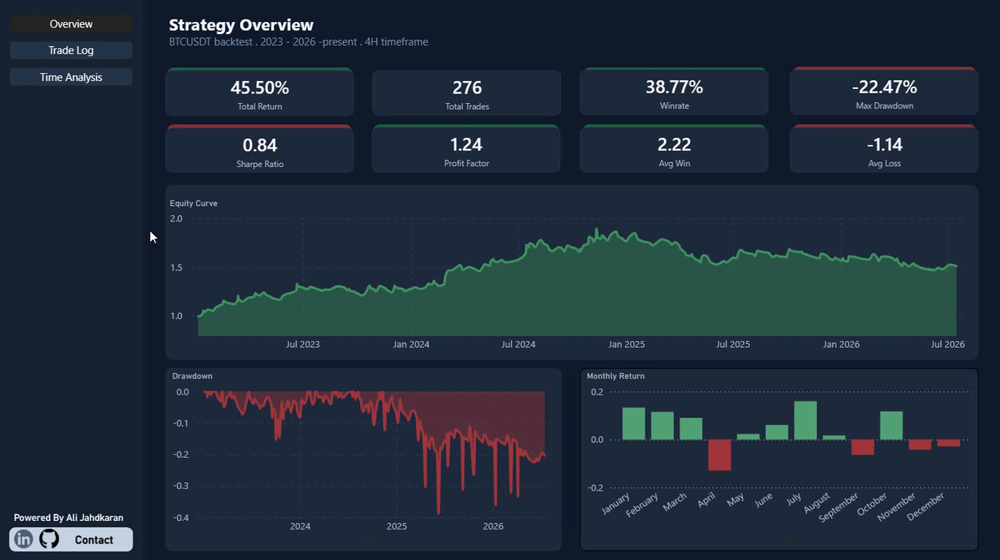

*The English version of this README is available below the Persian (Farsi) section.*

---

# Advanced Quant Trading Analytics

این پروژه یک پورتفولیوی جامع در حوزه تحلیل داده‌های کمی (Quantitative Data Analysis) است که فرآیند کامل (End-to-End) کار با داده‌های واقعی بازارهای مالی را نشان می‌دهد. هدف این پروژه، فراتر از یک بک‌تست ساده، نمایش توانایی استخراج داده‌های خام، مهندسی ویژگی‌های مالی، پیاده‌سازی منطق الگوریتمی و در نهایت مصورسازی مینیمال و مدیریتیِ نتایج است.

**

## مسیر استخراج داده‌ها (Data Pipeline)

برای دریافت داده‌های تاریخی باکیفیت و بدون نقص، از کتابخانه **`ccxt`** جهت اتصال مستقیم به API عمومی صرافی Binance استفاده شده است.
دیتای جفت‌ارز **BTC/USDT** در تایم‌فریم **۴ ساعته (4H)** از ابتدای سال ۲۰۲۳ تا اواسط ۲۰۲۶ دانلود شده است. برای غلبه بر محدودیت‌های سرور صرافی (ارسال حداکثر ۱۰۰۰ کندل در هر درخواست)، یک منطق حلقه‌بندی زمان‌محور (Time-based Pagination) در اسکریپت پایتون پیاده‌سازی شد تا داده‌ها به‌صورت یکپارچه و زنجیره‌ای استخراج و در قالب فایل CSV ذخیره شوند.

## منطق استراتژی و مهندسی ویژگی‌ها

استراتژی مورد تحلیل، یک سیستم شکست قیمتی (Breakout) مبتنی بر نوسانات و حجم معاملات است:

* **سطوح دینامیک:** محاسبه سقف‌های متحرک (Rolling Max) بر اساس قیمت `Close` در دوره ۱۴ کندلی.
* **تایید حجم (Volume Filter):** برای فیلتر کردن شکست‌های جعلی (Fake Breakouts)، حجم کندلِ شکست باید حداقل **۱.۵ برابر** میانگین حجم ۱۴ کندل اخیر باشد.
* **مدیریت ریسک پویا:** تعیین حد سود و زیان بر اساس شاخص نوسانات (ATR) دوره ۱۴. حد ضرر (SL) معادل `1xATR` و حد سود (TP) معادل `2xATR` تنظیم شده است تا نسبت ریسک به ریوارد (R:R) دقیقاً ۱:۲ حفظ شود.
* *شرط هم‌زمانی:* سیستم در هر لحظه تنها اجازه باز بودن یک معامله را می‌دهد.

## شاخص‌های کلیدی عملکرد (KPIs)

بک‌تست استراتژی روی ۲۷۶ معامله بسته شده نتایج زیر را ثبت کرده است:

| معیار (Metric) | مقدار (Value) |
| --- | --- |
| **تعداد کل معاملات** | ۲۷۶ |
| **نرخ برد (Win Rate)** | ۳۸.۷۷٪ |
| **ضریب سودآوری (Profit Factor)** | ۱.۲۴ |
| **حداکثر افت سرمایه (Max Drawdown)** | -۲۲.۴۷٪ |
| **رشد مرکب (Compounded Return)** | ۵۱.۱۳٪ |
| **نسبت شارپ (Sharpe Ratio)** | ۰.۸۴ (سالانه) |
| **نسبت سورتینو (Sortino Ratio)** | ۳.۰۴ (سالانه) |
| **میانگین سود / ضرر هر معامله** | ۲.۲۲٪ / -۱.۱۴٪ |

## یافته‌های تحلیلی (Insights)

یکی از مهم‌ترین بخش‌های این تحلیل، بررسی رفتار استراتژی در شرایط مختلف بازار است:

**۱. وابستگی شدید به رژیم بازار (Market Regime)**
عملکرد این استراتژی روندیاب، کاملاً به بازارهای صعودی قدرتمند (Bull Markets) وابسته است و در بازارهای رنج یا نزولی دچار افت می‌شود:

* **۲۰۲۳:** ۸۶ معامله ➔ **۲۳.۹٪+** سود
* **۲۰۲۴:** ۷۹ معامله ➔ **۳۵.۷٪+** سود
* **۲۰۲۵:** ۷۷ معامله ➔ **۱۰.۴٪-** ضرر
* **۲۰۲۶ (تا کنون):** ۳۴ معامله ➔ **۳.۷٪-** ضرر

**۲. الگوهای زمانی (Time Analysis)**
*بررسی عملکرد بر اساس روزهای هفته و ساعات روز (UTC):*

* **روزهای هفته:** پنجشنبه (+۰.۶۶٪) و یکشنبه (+۰.۶۴٪) بهترین بازدهی و شنبه (-۱.۶٪) بدترین بازدهی را داشته‌اند.
* **ساعات روز:** سشن معاملاتی ۲۰:۰۰ UTC (+۰.۷۷٪) بهترین و ۱۶:۰۰ UTC (~۰٪) ضعیف‌ترین عملکرد را ثبت کرده است.

## محدودیت‌های شناخته‌شده (Limitations)

در راستای شفافیت تحلیلی، موارد زیر در این مدل لحاظ شده‌اند:

* حجم نمونه در تفکیک‌های زمانی (روز/ساعت) کوچک است (حدود ۳۵ تا ۴۵ معامله در هر گروه). این آمار مشاهدات اولیه هستند و قطعیت آماری ندارند.
* چک‌های کیفی داده‌ها (پر کردن گپ‌ها یا کندل‌های از دست رفته) به‌طور عمدی و برای حفظ یکپارچگی دیتای خام صرافی انجام نشده‌اند.
* در صورت رسیدن هم‌زمان قیمت به حد سود و ضرر در یک کندل، مدل به‌صورت محافظه‌کارانه فرض می‌کند که ابتدا حد ضرر (SL) تاچ شده است.
* پارامترهای استراتژی (مانند ضریب ۱.۵ برای حجم یا طول دوره ۱۴) مقادیر ثابت هستند و بهینه‌سازی (Optimization) روی آن‌ها صورت نگرفته است.

## معماری داشبورد (Power BI)

برای مصورسازی داده‌ها، یک داشبورد سه‌صفحه‌ای (Overview, Trade Log, Time Analysis) با تم Dark Mode طراحی شده است. تمرکز اصلی بر روی مینیمالیسم، دوری از شلوغی‌های بصری معمول، و استفاده از رنگ‌های خنثی (Navy) در کنار رنگ‌های تاکیدی برای سود و زیان بوده است تا تجربه‌ای مشابه پلتفرم‌های نهادی و کوانت ارائه دهد.

---

---

# 🇬🇧 Advanced Quant Trading Analytics

*(Placeholder for your dashboard GIF)*

This portfolio project focuses on Quantitative Data Analysis using real-world financial market data. It demonstrates a complete end-to-end analytical pipeline, from raw data extraction and financial feature engineering to algorithmic backtesting and minimal, executive-level data visualization.

## Data Pipeline & Extraction

To ensure high-quality, continuous historical data, the **`ccxt`** library was utilized to connect directly to the Binance public API.
Historical **BTC/USDT** data was extracted on a **4-Hour (4H)** timeframe spanning from early 2023 to mid-2026. To bypass server-side rate limits (max 1000 candles per request), a time-based pagination loop was engineered in Python to fetch the data sequentially and store it into a clean CSV dataset.

## Strategy Logic & Feature Engineering

The analyzed strategy is a Breakout system relying on volatility and volume confirmation:

* **Dynamic Levels:** Rolling maximums based on the `Close` price over a 14-period window.
* **Volume Filter:** To filter out fake breakouts, the breakout candle's volume must be at least **1.5x** the average volume of the previous 14 periods.
* **Dynamic Risk Management:** Stop Loss (SL) and Take Profit (TP) are calculated using the Average True Range (ATR) over 14 periods. SL is set at `1xATR` and TP at `2xATR`, maintaining a strict 1:2 Risk-to-Reward ratio.
* *Concurrency:* The system strictly allows only one open position at any given time.

## Key Performance Indicators (KPIs)

The backtest executed 276 closed trades with the following performance metrics:

| Metric | Value |
| --- | --- |
| **Total Trades** | 276 |
| **Win Rate** | 38.77% |
| **Profit Factor** | 1.24 |
| **Max Drawdown** | -22.47% |
| **Compounded Return** | 51.13% |
| **Sharpe Ratio** | 0.84 (Annualized) |
| **Sortino Ratio** | 3.04 (Annualized) |
| **Average Win / Loss** | +2.22% / -1.14% |

## Key Insights & Time Analysis

A critical aspect of this analysis is understanding the strategy's behavior under different market conditions:

**1. Market Regime Dependency**
As a trend-following system, the performance is heavily reliant on strong Bull Markets and experiences drawdowns during ranging or bearish regimes:

* **2023:** 86 trades ➔ **+23.9%** PnL
* **2024:** 79 trades ➔ **+35.7%** PnL
* **2025:** 77 trades ➔ **-10.4%** PnL
* **2026 (YTD):** 34 trades ➔ **-3.7%** PnL

**2. Temporal Patterns**
*Performance breakdown by Weekday and Hour (UTC):*

* **Weekdays:** Thursdays (+0.66%) and Sundays (+0.64%) yielded the best returns, while Saturdays (-1.6%) performed the worst.
* **Hours:** The 20:00 UTC session (+0.77%) showed the strongest performance, whereas 16:00 UTC (~0%) was the weakest.

## Known Limitations

For absolute analytical transparency, the following constraints apply to this model:

* The sample size for the weekday/hour breakdowns is relatively small (~35-45 trades per group). These are preliminary observations, not definitive statistical laws.
* Data quality checks (e.g., interpolating missing candles) were intentionally bypassed to maintain the integrity of the raw exchange data.
* In the event of a single candle hitting both TP and SL, the model conservatively assumes the Stop Loss was hit first.
* Strategy parameters (such as the 1.5x volume multiplier or the 14-period lookback) are fixed and have not undergone formal optimization.

## Business Intelligence (Power BI)

A three-page dashboard (Overview, Trade Log, Time Analysis) was developed to visualize the results. The design follows a strict Dark Mode, minimal aesthetic, utilizing a deep navy background with stark accent colors for profitability. This ensures the UI reflects a professional, institutional-grade quantitative platform, free from unnecessary visual clutter.

### Tech Stack

* **Python:** Pandas, NumPy, `ccxt`
* **Data Viz:** Power BI (DAX, Power Query)
